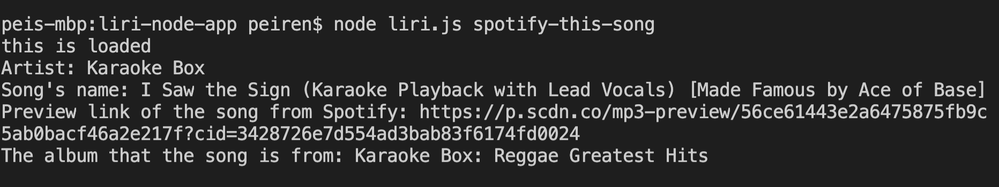
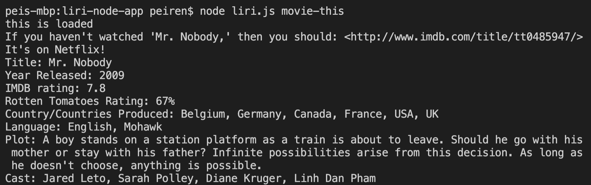
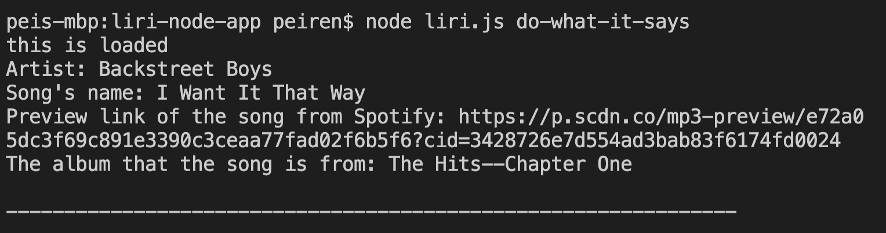

# liri-node-app

## Intro
This Liri app is a command line node app that takes in parameters and gives the users back data. It searches Spotify for songs, Bandsintown for concerts, and OMDB for movies.

## Four commands this liri app can take. And each command should do the following
1. node liri.js concert-this (artsit)

2. node liri.js spotify-this-song (song name)

* If the user doesn't give a song name, by default, it will output data for the song, The Sign by Ace of Base.

3. node liri.js movie-this (movie name)

* If the user doesn't give a movie name, by default, it will output data for the movie "Mr.Nobody", and a message of "If you haven't watched "Mr. Nobody," then you should: <http://www.imdb.com/title/tt0485947/>. It's on Netflix!"

4. node liri.js do-what-it-says 

